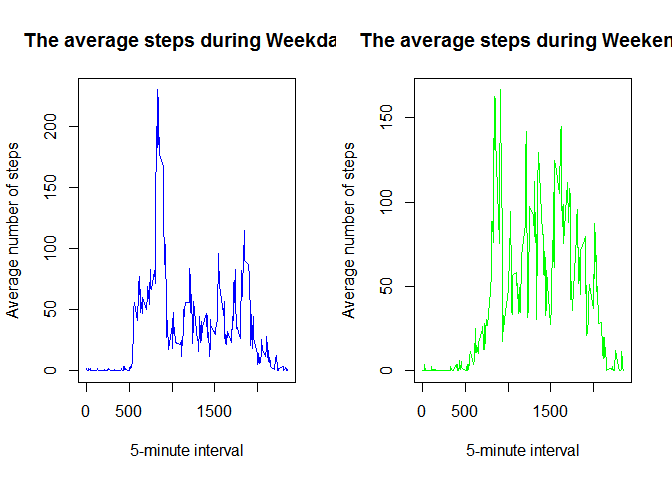

# Reproducible Research: Peer Assessment 1

#Introduction

It is now possible to collect a large amount of data about personal movement using activity monitoring devices such as a Fitbit, Nike Fuelband, or Jawbone Up. These type of devices are part of the "quantified self" movement - a group of enthusiasts who take measurements about themselves regularly to improve their health, to find patterns in their behavior, or because they are tech geeks. But these data remain under-utilized both because the raw data are hard to obtain and there is a lack of statistical methods and software for processing and interpreting the data.

This assignment makes use of data from a personal activity monitoring device. This device collects data at 5 minute intervals through out the day. The data consists of two months of data from an anonymous individual collected during the months of October and November, 2012 and include the number of steps taken in 5 minute intervals each day.

#Solution


```r
knitr::opts_chunk$set(echo = TRUE)

#Set working directory to the directory where the unzipped data file is located

#Clean workspace
rm(list=ls())


#Code for reading in the dataset and/or processing the data
#Read data
activity <- read.csv("activity.csv")

#High level look of the data
str(activity[1:5,])
```

```
## 'data.frame':	5 obs. of  3 variables:
##  $ steps   : int  NA NA NA NA NA
##  $ date    : Factor w/ 61 levels "2012-10-01","2012-10-02",..: 1 1 1 1 1
##  $ interval: int  0 5 10 15 20
```

```r
# Clean data
activityClean <- na.omit(activity)

#Convert date variable from factor type to date type
activityClean$dateClean <- as.Date(activityClean$date)


#Calculate the total number of steps taken per day
library(plyr)
stepsByDate <- ddply(activityClean, "dateClean", summarize, steps = sum(steps))

#Histogram of the total number of steps taken each day
hist(stepsByDate$steps, breaks=seq(from=0, to=25000, by=2500),
     col="green", 
     xlab="Total number of steps", 
     main="The total number of steps taken each day")
```


```r
#Mean and median number of steps taken each day
mean(stepsByDate[,2], na.rm = TRUE)
```

```
## [1] 10766.19
```

```r
median(stepsByDate[,2], na.rm = TRUE)
```

```
## [1] 10765
```

```r
#Time series plot of the average number of steps taken
stepsbyInterval <- ddply(activityClean, "interval", summarize, steps = mean(steps))
stepsbyInterval$steps <- round(stepsbyInterval$steps,0)
plot(stepsbyInterval$interval, stepsbyInterval$steps, type = "l", col="red",  
     xlab = "5-minute interval",
     ylab="Average number of steps", 
     main="The average number of steps taken for every 5 minute interval")
```


```r
#The 5-minute interval that, on average, contains the maximum number of steps
stepsbyInterval[which(grepl(max(stepsbyInterval$steps), stepsbyInterval$steps)),1]
```

```
## [1] 835
```

```r
#Imputing missing values

#Calculate and report the total number of missing values in the dataset 
numNAs <- as.data.frame(table(complete.cases(activity)))
numNAs[1,2]
```

```
## [1] 2304
```

```r
#create a vector which replaces NAs with mean values for the particular interval 
a <- numeric()
for (i in 1:length(activity$steps)) {
  if (is.na(activity[i,1])) {
    
    a[i] <- stepsbyInterval[match(activity[i,3], stepsbyInterval$interval),2]
  
    } else {   
    
      a[i] <- activity[i,1]
  
  }

}

#Create a new dataset that is equal to the original dataset but with the missing data filled in.
activityNew <- cbind(activity, a)
activityNew <- activityNew[, -1]
activityNew <- rename(activityNew, c("a"="steps"))

activityNew$date <- as.Date(activityNew$date)
stepsByDate <- ddply(activityNew, "date", summarize, steps = sum(steps))

#Histogram of the total number of steps taken each day
hist(stepsByDate$steps, breaks=seq(from=0, to=25000, by=2500),
     col="blue", 
     xlab="Total number of steps", 
     main="The total number of steps taken each day (NAs replaced)")
```


```r
#Mean and median number of steps taken each day
mean(stepsByDate[,2])
```

```
## [1] 10765.64
```

```r
median(stepsByDate[,2])
```

```
## [1] 10762
```

```r
#Assign day type
activityNew$weekday <- ifelse(weekdays(activityNew$date) == "Saturday", "weekend", ifelse(weekdays(activityNew$date) == "Sunday", "weekend", "weekday"))

#take out weekday and summarize data
activityWeekday <- activityNew[activityNew$weekday == "weekday", ]
stepsbyIntervalWD <- ddply(activityWeekday, "interval", summarize, steps = mean(steps))
stepsbyIntervalWD$steps <- round(stepsbyIntervalWD$steps,2)

activityWeekend <- activityNew[activityNew$weekday == "weekend", ]
stepsbyIntervalWE <- ddply(activityWeekend, "interval", summarize, steps = mean(steps))
stepsbyIntervalWE$steps <- round(stepsbyIntervalWE$steps,2)

#time series plots of the 5-minute interval and the average number of steps taken, averaged across all weekday days or weekend days
par(mfcol = c(1,2))
plot(stepsbyIntervalWD$interval, stepsbyIntervalWD$steps, type = "l", col="blue", 
     xlab = "5-minute interval",
     ylab="Average number of steps", 
     main="The average steps during Weekday")
plot(stepsbyIntervalWE$interval, stepsbyIntervalWE$steps, type = "l", col="green", 
     xlab = "5-minute interval",
     ylab="Average number of steps", 
     main="The average steps during Weekend")
```


